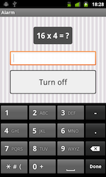

wakeup
======
## Introduction
This is an Android app. Basically is an alarm clock but it has two main differences from others conventional alarm clocks:

*  Lists of ringtones defined by the user.
*  Is needed to do a challenge to turn off the alarm.

The first functionality allows the user to set a list of ringtones that will be played randomly, in this way the user won't have a dislike with the same ringtone as always. The second one makes sure that the user is really weaking up and not coming back to sleep.

##Screenshots
       
